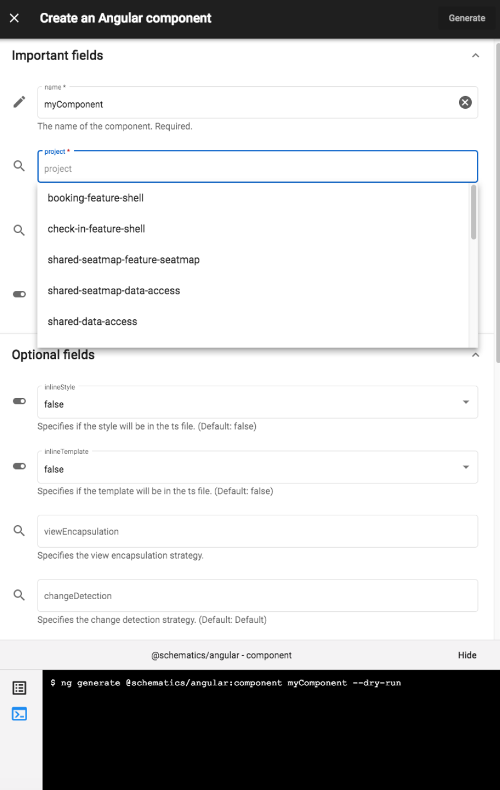

# Получение помощи

При использовании терминала все команды Nx имеют флаг <mark style="color:red;">`--help`</mark> для отображения доступных опций и описания каждой из них. Angular Console отображает текст справки визуально, а также предоставляет список опций, сгруппированных по степени их обязательности.&#x20;

Пример вывода приведен ниже:&#x20;

Выполните <mark style="color:red;">`ng generate lib --help`</mark>, чтобы увидеть список доступных опций:

```
// Вывод при использовании опции --help
usage: ng generate lib <name> [options]
options:
  --directory
    A directory where the app is placed
  --dryRun (-d)
    Run through without making any changes.
  --force (-f)
    Forces overwriting of files.
  --lazy
    Add RouterModule.forChild when set to true, and a simple array of routes when
set to false.
  --parent-module
    Update the router configuration of the parent module using loadChildren or children, depending on what `lazy` is set to.
  --prefix (-p)
    The prefix to apply to generated selectors.
  --publishable
    Generate a simple TS library when set to true.
  --routing
    Add router configuration. See lazy for more information.
  --skip-format
    Skip formatting files
  --skip-package-json
    Do not add dependencies to package.json.
  --skip-ts-config
   Do not update tsconfig.json for development experience.
  --tags
    Add tags to the library (used for linting)
  --unit-test-runner
    Test runner to use for unit tests
```

Получить помощь можно также с помощью Angular Console, которая предоставляет все опции для каждой команды вместе с описанием. Она также отделяет обязательные опции от необязательных и автоматически заполняет значения на основе вашего рабочего пространства (позволяя вам выбирать из списка вместо ручного ввода).

<figure><figcaption><p>Рисунок 3. Получение помощи с помощью Angular Console. Обратите внимание, что опции разделены на "обязательные" и "необязательные", а значения можно выбирать в выпадающем списке.</p></figcaption></figure>
