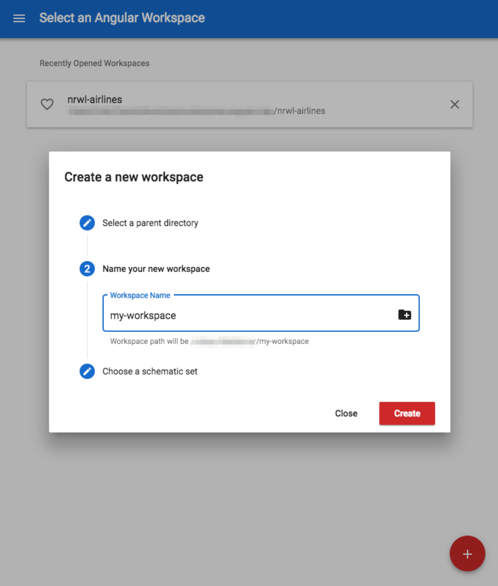

# Установка и настройка рабочего пространства

### Creating a Workspace

#### Создание рабочего пространства

Вы можете установить Nx следующим образом:

```shell
npm install -g @angular/cli @nrwl/schematics
```

Библиотека <mark style="color:red;">`@nrwl/schematics`</mark> содержит двоичный скрипт, который предоставляет команду <mark style="color:red;">`create-nx-workspace`</mark>. Эта команда может быть использована для создания нового рабочего пространства Nx:

```shell
create-nx-workspace myworkspacename
```

Это создает новое рабочее пространство Nx с использованием изолированной среды и запускает Angular CLI команду <mark style="color:red;">`ng new`</mark> "под капотом" с коллекцией схем (schematics) Nx.

Вы также можете добавить Nx в существующий проект CLI, выполнив команду:

```shell
ng add @nrwl/schematics
```

Наконец, вы можете создать рабочее пространство Nx с помощью Angular Console.

<figure><figcaption><p>Рисунок 2. Создание нового рабочего пространства в Angular Console</p></figcaption></figure>

Независимо от того, как вы создаете рабочую область, в итоге вы получаете рабочее пространство Nx со следующими файлами/папками.

```
// Содержимое рабочего пространства по умолчанию
apps/
libs/
tools/
angular.json
nx.json
tslint.json
tsconfig.json
```

Оно похоже на стандартные проекты Angular CLI с некоторыми изменениями:&#x20;

* Папка <mark style="color:red;">`apps`</mark>, в которую помещаются все приложения.
* Имеется каталог <mark style="color:red;">`libs`</mark>, в котором размещается весь код пользовательских библиотек

Краткое описание каждого из них приведено ниже; мы будем расширять его по мере продвижения по тексту книгу.

* **apps/**: Здесь находятся все приложения и папки e2e.
* **libs/**: Здесь размещаются библиотеки
* **tools/**: Используется для инструментов, например, схем (schematics) рабочего пространства.
* **angular.json**: Используется Angular CLI для описания проектов (приложений и библиотек), способов их сборки и тестирования и т.д.
* **nx.json**: Используется Nx для предоставления метаданных для проектов, например, тегов.
* **tslint.json**: Это файл конфигурации линтера
* **tsconfig.json**: Это tsconfig рабочего пространства. Nx добавляет сюда алиасы путей для каждой библиотеки, чтобы обеспечить импорт в зависимости от рабочего пространства и т.д.

```typescript
import { myLib } from '@myProject/shared/my-lib';
```

В новом рабочем пространстве Nx не устанавливается начальное приложение, но добавить его очень просто.

### Создания приложения

Добавление новых приложений в рабочее пространство Nx осуществляется с помощью команды генерации Angular CLI. В Nx есть схема под названием <mark style="color:red;">`app`</mark>, которую можно использовать для добавления нового приложения в наше рабочее пространство:

```shell
ng generate app myapp
ng generate application myapp # same thing
```

Эта команда выполняет несколько действий:

1. Создает новое приложение, помещает его в каталог <mark style="color:red;">`apps`</mark> и настраивает файлы <mark style="color:red;">`angular.json`</mark> и <mark style="color:red;">`nx.json`</mark> для поддержки нового приложения.
2. Настраивает корневой модуль NgModule для импорт <mark style="color:red;">`NxModule`</mark>, чтобы мы могли воспользоваться преимуществами таких вещей, как например, <mark style="color:red;">`DataPersistence`</mark>.
3. Он также создает папку e2e для этого приложения, которая содержит код для e2e тестирования.

Выполните <mark style="color:red;">`ng generate app --help`</mark>, чтобы увидеть список доступных опций.

Большинство опций идентичны тем, которые поддерживаются приложением CLI по умолчанию, но следующие опции являются новыми или отличными: <mark style="color:red;">`directory`</mark>, <mark style="color:red;">`routing`</mark> и <mark style="color:red;">`tags`</mark>.

<mark style="color:red;">`ng generate app myapp --directory=myteam`</mark> создает новое приложение в <mark style="color:red;">`apps/myteam/myapp`</mark>.

* <mark style="color:red;">`ng generate app myapp --routing`</mark> настраивает корневой <mark style="color:red;">`NgModule`</mark> для подключения роутинга, а также добавляет в шаблон <mark style="color:red;">`AppComponent`</mark> <mark style="color:red;">`<router-outlet>`</mark>, чтобы помочь нам начать работу.
* <mark style="color:red;">`ng generate app myapp --tags=scope:shared,type:app`</mark> аннотирует созданное приложение двумя тегами, которые могут быть использованы для расширенного анализа кода. Подробнее об этом читайте в разделе "Ограничения для библиотеки" в **третьей части**.

После создания приложения мы можем начать создавать библиотеки, которые содержат все компоненты и логику, составляющие приложение.

### Создание библиотеки

Добавление новых библиотек в рабочее пространство Nx осуществляется с помощью команды генерации Angular CLI, как и при добавлении нового приложения.&#x20;

```shell
ng generate lib mylib
ng generate library mylib # то же самое
```

Это создаст новую библиотеку, поместит ее в каталог <mark style="color:red;">`libs`</mark> и настроит файлы <mark style="color:red;">`angular.json`</mark> и <mark style="color:red;">`nx.json`</mark> для поддержки новой библиотеки.

Дальнейшее описание опций см. в разделе "Замечания по использованию библиотек".
