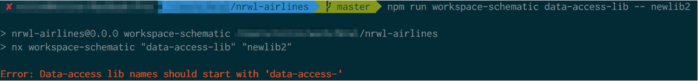
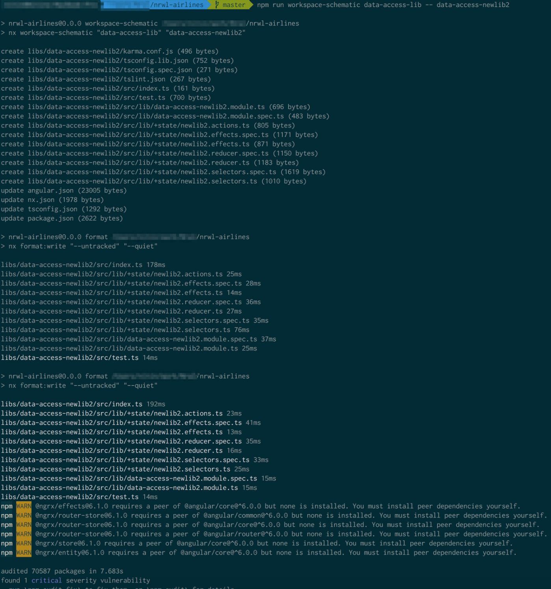

# Использование схем рабочего пространства

Схемы дают возможность выполнять скрипты в рабочем пространстве через CLI. Они выполняются для файлов и каталогов в рабочем пространстве и могут добавлять, изменять, копировать, перемещать или удалять их по мере необходимости. Они имеют множество применений, некоторые из которых мы описываем ниже.

* Генерация кода: Мы можем создавать схемы для генерации кода, когда нам нужен новый тип библиотеки, новая сущность ngrx, генерация кода ngrx к существующей библиотеке и т.д.
* Обновление наших проектов: Мы можем запускать скрипты для обновления нашего рабочего пространства определенными способами по мере необходимости.
* Внесение автоматизированных изменений во все рабочее пространство: Например, нам может потребоваться выполнить последовательность действий во всех библиотеках: создать папку <mark style="color:red;">`+state`</mark> и переместить все файлы, связанные с состоянием (actions, reducers, selectors и facades), в эту папку, обновив barrel файл. Использование схемы помогло бы здесь вместо того, чтобы делать это вручную.

Одним из преимуществ использования схемы является то, что она выполняет изменения в представлении в памяти, а не выполняет их непосредственно в файловой системе. Если все выглядит хорошо, мы можем запустить схему без пробного запуска (<mark style="color:red;">`dry-run`</mark>) для сохранения изменений.

Nx поставляется с некоторыми встроенными схемами.

### Встроенные схемы Nx

Следующие схемы можно найти в коллекции <mark style="color:red;">`@nrwl/schematics`</mark>.

* **ngrx**: Эта схема использует ngrx для проекта и создает базовые редьюсеры, экшены, селекторы и необязательный фасад.
* **node**: Эта схема создает на выбор пустое или Экспресс приложение и подключает его для запуска вместе с приложениями Angular.
* **jest**: Коллекция содержит две схемы для jest: добавление поддержки jest в рабочее пространство и добавление jest в качестве тестового раннера для библиотек.
* **cypress**: Эта схема настраивает рабочее пространство для использования cypress для e2e тестирования.
* **downgrade module**: Эта схема модифицирует ваш проект для использования модуля ngDowngradeModule.
* **new**: Коллекция содержит схемы для создания и загрузки нового рабочего пространства, нового приложения или новой библиотеки.
* **add**: Эта схема позволяет добавлять другие схемы в ваше рабочее пространство.
* **upgrade**: Эта схема используется для обновления версий Nx и соответствующих зависимостей от аналогов (Angular, RxJs и т.д.). Это внутренняя схема и используется npm скриптом <mark style="color:red;">`upgrade`</mark>.

Нам могут потребоваться специфические схемы для нашей организации. Nx может помочь и с ними.

### Создание пользовательской схемы

Рассмотрим следующий сценарий: мы хотим продвигать паттерн инкапсуляции кода, связанного с NgRx, в data-access библиотеки. Другими словами, мы хотим сделать следующее:

* Проверьте, что имя библиотеки начинается с <mark style="color:red;">`data-access-`</mark>.
* Вызовите схему <mark style="color:red;">`ngrx`</mark> с этим новым именем библиотеки и передайте ей другие опции.&#x20;

Начните с генерации новой схемы рабочего пространства.

```shell
ng g workspace-schematic data-access-lib
```

Это создает следующее:

```
tools/
  schematics/
    data-access-lib/
      index.ts (1)
      schema.json (2)
```

1. Это основной файл схемы.
2. Это файл, который содержит схему JSON для аргументов, которые мы получаем из CLI (если вы хотите использовать ее для проверки вводящих аргументов в схеме).

Файл <mark style="color:red;">`index.ts`</mark> имеет следующее содержимое:


```typescript
import { chain, externalSchematic, Rule } from '@angular-devkit/schematics';

export default function(schema: any): Rule {
  return chain([
    externalSchematic('@nrwl/schematics', 'lib', { // (1)
      name: schema.name
    })
  ]);
}
```


1. В представленном примере схемы вызывается <mark style="color:red;">`lib`</mark> генератор из <mark style="color:red;">`@nrwl/schematics`</mark>. Его следует заменить на вашу реальную реализацию.


```typescript
import { chain, externalSchematic, Rule } from '@angular-devkit/schematics'; 
import * as path from 'path';

export default function(schema: any): Rule {
  if (!schema.name.startsWith('data-access-')) { // (1)
    throw new Error(`Data-access lib names should start with 'data-access-'`);
  }
  
  const stateName = schema.name.replace('data-access-', '');
  
  return chain([ // (2)
    externalSchematic('@nrwl/schematics', 'lib', { // (3)
      name: schema.name,
      tags: 'type:data-access'
    }),
    
    externalSchematic('@nrwl/schematics', 'ngrx', { // (4)
      name: stateName, // (5)
      module: path.join(
        'libs',
        schema.name,
        'src',
        'lib',
        `${schema.name}.module.ts`
      )
    })
  ]);
}
```


1. Здесь проверяется <mark style="color:red;">`data-access`</mark> префикс.
2. <mark style="color:red;">`chain`</mark> позволяет нам предоставить несколько схем для выполнения по порядку.
3. Сначала мы создаем новую библиотеку, используя <mark style="color:red;">`@nrwl/schematics`</mark>.
4. Затем мы снова генерируем ngrx код с помощью <mark style="color:red;">`@nrwl/schematics`</mark>.
5. Мы используем имя библиотеки (без префикса <mark style="color:red;">`data-access`</mark>) в качестве имени состояния в ngrx.

Наконец, давайте используем эту схему для создания новой data-access библиотеки.

```shell
npm run workspace-schematic data-access-lib -- data-access-newlib2
```

Эта команда состоит из нескольких частей. <mark style="color:red;">`npm run workspace-schematic`</mark> принимает аргумент для имени схемы. В нашем случае это <mark style="color:red;">`data-access-lib`</mark>. Остальные аргументы следуют за <mark style="color:red;">`--`</mark>, чтобы обойти npm и передать из вызываемой команде (<mark style="color:red;">`data-access-newlib2`</mark>, это имя нашей новой библиотеки).

<figure><figcaption><p>Рисунок 10. Результат выполнения нашей новой схемы без указания префикса</p></figcaption></figure>

<figure><figcaption><p>Рисунок 11. Результат успешного запуска нашей новой схемы</p></figcaption></figure>

Теперь мы можем создавать схемы, которые помогут сделать наш код согласованным во всех проектах и абстрагироваться от некоторых шаблонов.

Давайте рассмотрим, как мы можем применить согласованность в наших приложениях Angular при выполнении сетевых вызовов.
