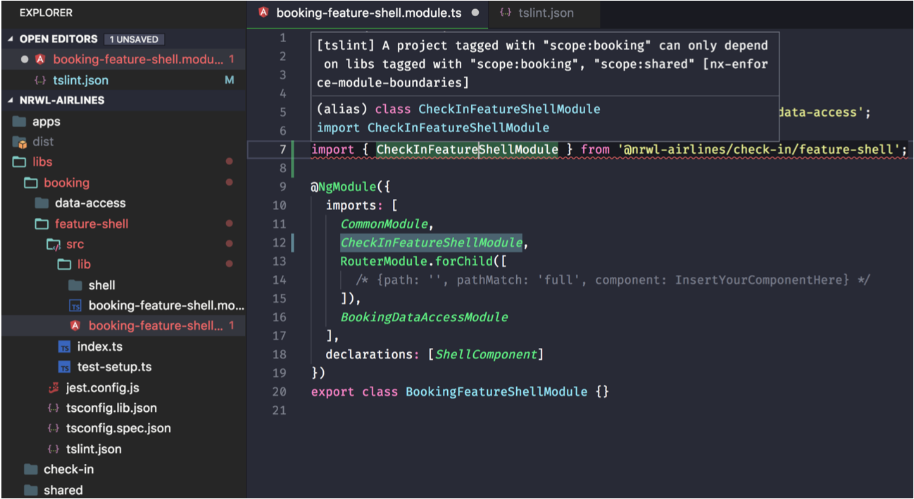
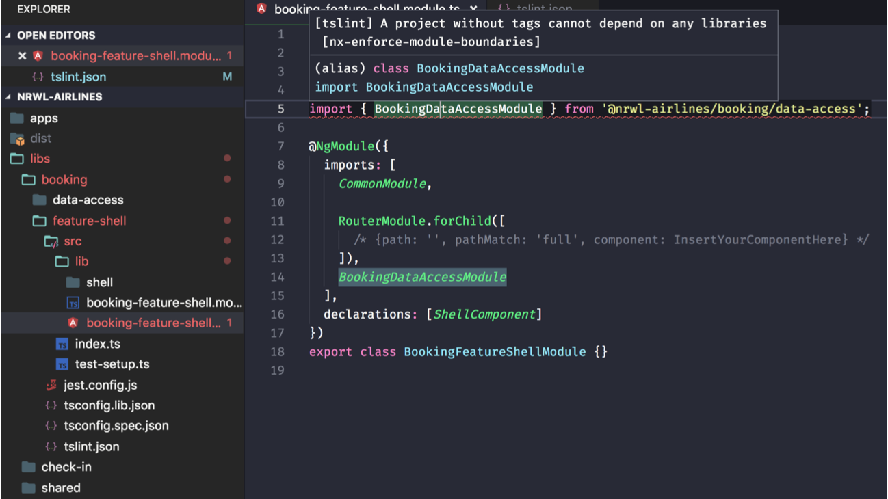

# Обеспечение ограничений в зависимостях библиотек

Рабочее пространство Nx - это большой граф зависимостей. Приложения зависят от библиотек, которые, в свою очередь, зависят от других библиотек, и так далее. Когда есть много команд и много библиотек, это может привести к путанице в том, какие библиотеки должны зависеть от других. Рассмотрим примерный сценарий:

> Алиса хочет добавить HTTP interceptor в библиотеку, которая находится в <mark style="color:red;">`seatmap/util`</mark>. Однако этому interceptor'у нужно значение из Store. Должна ли библиотека util зависеть от <mark style="color:red;">`data-access`</mark> библиотеки в seatmap?

Ответ на этот вопрос заключается в том, что согласно определению библиотеки <mark style="color:red;">`util`</mark> в Nx это будет неправильно - Алиса должна переместить interceptor в папку <mark style="color:red;">`data-access`</mark>, чтобы он мог ссылаться на значение из Store.

Однако в рабочем пространстве по умолчанию нет ничего, что мешает Алисе оставить interceptor в <mark style="color:red;">`util`</mark> и импортировать его из <mark style="color:red;">`data-access`</mark>. Эта проблема может не проявиться до тех пор, пока не будет обнаружена круговая зависимость.

Давайте рассмотрим некоторые способы, с помощью которых мы можем увидеть или предотвратить это.

### Анализ и визуализация графика зависимостей

Nx использует расширенный анализ кода для построения графа зависимостей всех приложений и библиотек в рабочем пространстве и их зависимости друг от друга.

Вы можете визуализировать все рабочее пространство, выполнив <mark style="color:red;">`npm run dep-graph`</mark>.

<figure><figcaption><p>Рисунок 5. Граф зависимостей рабочего пространства</p></figcaption></figure>

Вы также можете визуализировать, на что повлияло ваше изменение, с помощью команды <mark style="color:red;">`affected:dep-graph`</mark>.

<figure><figcaption><p>Рисунок 6. Граф зависимостей, когда мы вносим изменения в check-in-data-access</p></figcaption></figure>


В четвертой части книги рассматривается, как сообщить <mark style="color:red;">`affected`</mark> командам, какие изменения файлов следует использовать для определения всех приложений и библиотек, на которые влияют эти изменения кода.

dep-graph выделяет затронутые приложения и библиотеки и прослеживает критический путь.

По умолчанию команды <mark style="color:red;">`dep-graph`</mark> и <mark style="color:red;">`affected:dep-graph`</mark> открывают браузер для отображения графа, но вы также можете вывести граф в файл, выполнив команду:

* <mark style="color:red;">`npm run dep-graph --file=graph.json`</mark> выводит json-файл.
* <mark style="color:red;">`npm run dep-graph --file=graph.dot`</mark> выводит dot файл.
* <mark style="color:red;">`npm run dep-graph --file=graph.svg`</mark> создает svg-файл.

Angular Console имеет более интерактивную визуализацию: вы можете переходить к определенным приложениям/либам, выбирать затронутые или выбранные тесты, а также выбирать различные ветки.

<figure><figcaption><p>Рисунок 7. Angular Console имеет интерактивный граф зависимостей</p></figcaption></figure>

Теперь, когда мы знаем, как визуализировать зависимости, давайте рассмотрим, как помочь Алисе.

### Обеспечение ограничений в рабочем пространстве

Nx использует анализ кода, чтобы убедиться, что проекты могут зависеть только от четко определенных публичных API друг друга. Он также позволяет декларативно накладывать ограничения на то, как проекты могут зависеть друг от друга.

Nx поставляется с некоторыми настройками по умолчанию, которые должны применяться ко всем рабочим пространствам, и позволяет создавать собственные правила, необходимые организации.

#### Универсальные ограничения

Следующие условия должны быть верны для всех рабочих пространств:

1. **lib** не может зависеть от **app**
2. Проект не может иметь круговых зависимостей
3. Проект, который лениво загружает другой проект, не может импортировать его напрямую.

Nx поставляется с несколькими предопределенными правилами, которые применяются ко всем рабочим пространствам:

* Библиотеки не могут импортировать приложения.
* Проект, загружающий библиотеку с помощью <mark style="color:red;">`loadChildren`</mark>, не может также импортировать ее с помощью ESM-импорта.
* Циклические зависимости не допускаются.
* Библиотеки не могут быть импортированы с помощью относительных импортов.

```json
// Схемы Nx также включают это по умолчанию
"nx-enforce-module-boundaries": [
  true, // (1)
  {
    "allow": [], // (2) 
    "depConstraints": [
      { "sourceTag": "*", "onlyDependOnLibsWithTags": ["*"] } // (3)
    ]
  }
]
```

1. Это флаг, который включает правило.
2. Это белый список, который обходит проверки в <mark style="color:red;">`depConstraints`</mark> - см. раздел "Исключения" ниже.
3. Здесь мы указываем явные правила зависимостей, основанные на тегах в библиотек нашего рабочего пространства.

### Создание собственных ограничений на зависимости библиотек

Ниже приведены некоторые примеры рекомендуемых правил использования рабочего пространства:

1. Библиотека **конкретного приложения** не может зависеть от библиотеки другого приложения (например, "booking/_"_ может зависеть только от библиотеки из "booking/" или общих (shared) библиотек).
2. **Shared библиотека** не может зависеть от **специфической для приложения** библиотеки (например, "shared-data-access" не может зависеть от "booking-data-access").
3. **UI библиотека** не может зависеть от feature библиотеки или data-access библиотеки.
4. **Util** **библиотека** может зависеть только от других <mark style="color:red;">`util`</mark> библиотек.
5. data-access библиотека не может зависеть от feature или ui библиотеки.

Эти ограничения выполняются следующими способами:

* IDE и редакторы отображают ошибку, если вы пытаетесь нарушить эти правила (если они настроены на распознавание правил tslint).
* CI упадет, если мы используем команду lint в пайплайне.

Ограничения определяются с помощью правил в <mark style="color:red;">`tslint.json`</mark> и тегов в <mark style="color:red;">`nx.json`</mark>:

```shell
ng g lib feature-destination --directory=booking --tags=scope:booking,type:feature
```

Обратите внимание, вы также можете изменить теги в nx.json как показано ниже:

```json
"booking-feature-destination": {
  "tags": ["scope:booking", "type:feature"]
},
"booking-shell": {
  "tags": []
},
```

После того как теги будут связаны с каждой библиотекой, можно определить правила tsLint для настройки ограничений:


```json
"nx-enforce-module-boundaries": [
  true,
  {
    "allow": [], // (1)
    "depConstraints": [
      {
        "sourceTag": "scope:shared", // (2)
        "onlyDependOnLibsWithTags": ["scope:shared"]
      },
      {
        "sourceTag": "scope:booking", // (3)
        "onlyDependOnLibsWithTags": ["scope:booking", "scope:shared"]
      },
      {
        "sourceTag": "type:util", // (4)
        "onlyDependOnLibsWithTags": ["type:util"]
      }
    ]
  } 
]
```


1. Параметр allow позволяет нам указать белый список, из которого мы можем импортировать, независимо от других правил в <mark style="color:red;">`depConstraints`</mark>.
2. Библиотека с тегом <mark style="color:red;">`scope:shared`</mark> может импортировать только из других библиотек с тегом <mark style="color:red;">`scope:shared`</mark>.
3. Библиотека с тегом <mark style="color:red;">`scope:booking`</mark> может импортировать только из библиотек с тегами <mark style="color:red;">`scope:booking`</mark> или <mark style="color:red;">`scope:shared`</mark>.
4. Библиотека с тегом <mark style="color:red;">`type:util`</mark> может импортировать только из другой библиотеки с тегом <mark style="color:red;">`type:util`</mark>.

С приведенной выше конфигурацией мы должны увидеть ошибку при попытке импортировать библиотеку из <mark style="color:red;">`check-in`</mark> в <mark style="color:red;">booking</mark> (нарушение правила 2).

<figure><figcaption><p>Рисунок 8. Ошибка, возникающая при попытке добавить CheckInFeatureShellModule в BookingFeatureShellModule</p></figcaption></figure>

С помощью ограничений зависимостей другая команда не сможет создать зависимость от вашей внутренней библиотеки. Вы можете определить, какие проекты содержат компоненты, код NgRx и функции, поэтому вы, например, можете запретить проектам, содержащим презентационные компоненты пользовательского интерфейса, зависеть от NgRx. Вы можете определить, какие проекты являются экспериментальными, а какие стабильными, так что стабильные приложения не могут зависеть от экспериментальных проектов и т.д.

По умолчанию Nx добавляет следующее правило, которое позволяет любой библиотеке импортировать из любой другой библиотеки:

```json
"depConstraints": [
  { "sourceTag": "*", "onlyDependOnLibsWithTags": ["*"] }
]
```

Мы можем отключить это правило, чтобы заставить все библиотеки явно указывать свои зависимости. Это приведет к следующей ошибке:

<figure><figcaption><p>Рисунок 9. Ошибка при удалении правила wilrcard (*)</p></figcaption></figure>

Мы рассмотрели, как обеспечить соблюдение правил, касающихся зависимостей от других приложений и библиотек. Некоторые файлы существуют в рабочем пространстве и не могут быть скрыты. Примерами могут служить <mark style="color:red;">`angular.json`</mark>, <mark style="color:red;">`tsconfig.json`</mark> и т.д. Давайте рассмотрим, как мы можем справиться и с ними.

### Неявные зависимости

В Nx есть поддержка неявных зависимостей: они охватывают все, что не входит в библиотеки или приложения. Они определяются в файле nx.json:

```json
"implicitDependencies": {
  "package.json": "*",
  "angular.json": "*",
  "tsconfig.json": "*",
  "tslint.json": "*",
  "nx.json": "*"
}
```

Строка <mark style="color:red;">`"package.json": "*"`</mark> говорит Nx, что изменение package.json влияет на каждый проект. Поскольку файл README корневого уровня не указан в списке, его изменение ни на что не повлияет.

Мы можем быть более конкретными и перечислить проекты, на которые влияет определенный файл.

```json
"implicitDependencies": {
  "tools/scripts/app1-rename-bundles.js": ["app1"]
}
```

Помимо возможности перечислить неявные зависимости между файлами и проектами, мы также можем добавить неявные зависимости между проектами. Например, рабочее пространство Nx может содержать код бэкенда для нашего приложения Angular. Код бэкенда неявно зависит от приложения Angular, но это не выражено в коде и поэтому не может быть выявлено Nx. Мы можем явно определить эту связь следующим образом:

```json
{
  "npmScope": "mycompany",
  "implicitDependencies": {
    "package.json": "*",
    "angular.json": "*",
    "tsconfig.json": "*",
    "tslint.json": "*",
    "nx.json": "*",
    
    "tools/scripts/app1-rename-bundles.js": ["app1"]
  },
  "projects": {
    "app": {},
    "backend": {
      "implicitDependencies": ["app"]
    }
  }
}
```

### Исключения

Как и во всем, есть исключения, которые также могут быть добавлены в ваш tslint.json.

```json
"nx-enforce-module-boundaries": [
  true,
  {
    "allow": ["@myworkspace/mylib"],
    "depConstraints": []
  }
]
```
