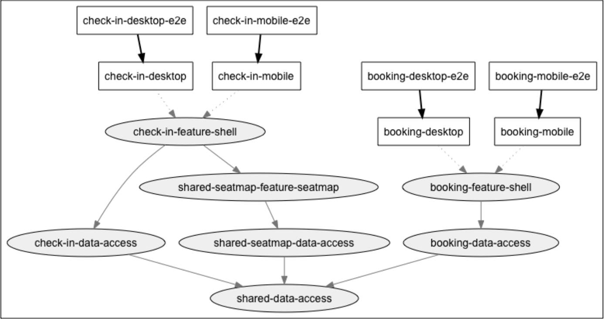
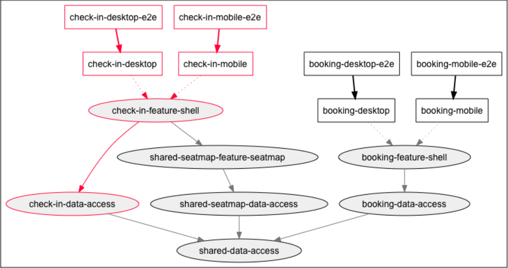
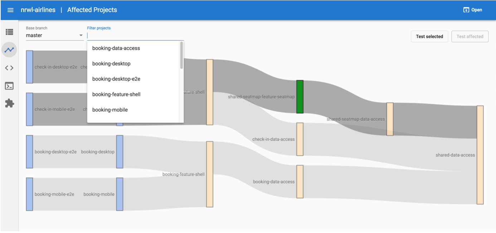

# Обеспечение ограничений в зависимостях библиотек

Рабочее пространство Nx - это большой граф зависимостей. Приложения зависят от библиотек, которые, в свою очередь, зависят от других библиотек, и так далее. Когда есть много команд и много библиотек, это может привести к путанице в том, какие библиотеки должны зависеть от других. Рассмотрим примерный сценарий:

> Алиса хочет добавить HTTP interceptor в библиотеку, которая находится в <mark style="color:red;">`seatmap/util`</mark>. Однако этому interceptor'у нужно значение из Store. Должна ли библиотека util зависеть от <mark style="color:red;">`data-access`</mark> библиотеки в seatmap?

Ответ на этот вопрос заключается в том, что согласно определению библиотеки <mark style="color:red;">`util`</mark> в Nx это будет неправильно - Алиса должна переместить interceptor в папку <mark style="color:red;">`data-access`</mark>, чтобы он мог ссылаться на значение из Store.

Однако в рабочем пространстве по умолчанию нет ничего, что мешает Алисе оставить interceptor в <mark style="color:red;">`util`</mark> и импортировать его из <mark style="color:red;">`data-access`</mark>. Эта проблема может не проявиться до тех пор, пока не будет обнаружена круговая зависимость.

Давайте рассмотрим некоторые способы, с помощью которых мы можем увидеть или предотвратить это.

### Анализ и визуализация графика зависимостей

Nx использует расширенный анализ кода для построения графа зависимостей всех приложений и библиотек в рабочем пространстве и их зависимости друг от друга.

Вы можете визуализировать все рабочее пространство, выполнив <mark style="color:red;">`npm run dep-graph`</mark>.

<figure><figcaption>
Рисунок 5. Граф зависимостей рабочего пространства
</figcaption></figure>

Вы также можете визуализировать, на что повлияло ваше изменение, с помощью команды <mark style="color:red;">`affected:dep-graph`</mark>.

<figure><figcaption>
Рисунок 6. Граф зависимостей, когда мы вносим изменения в check-in-data-access
</figcaption></figure>

В четвертой части книги рассматривается, как сообщить <mark style="color:red;">`affected`</mark> командам, какие изменения файлов следует использовать для определения всех приложений и библиотек, на которые влияют эти изменения кода.

dep-graph выделяет затронутые приложения и библиотеки и прослеживает критический путь.

По умолчанию команды <mark style="color:red;">`dep-graph`</mark> и <mark style="color:red;">`affected:dep-graph`</mark> открывают браузер для отображения графа, но вы также можете вывести граф в файл, выполнив команду:

* <mark style="color:red;">`npm run dep-graph --file=graph.json`</mark> выводит json-файл.
* <mark style="color:red;">`npm run dep-graph --file=graph.dot`</mark> выводит dot файл.
* <mark style="color:red;">`npm run dep-graph --file=graph.svg`</mark> создает svg-файл.

Angular Console имеет более интерактивную визуализацию: вы можете переходить к определенным приложениям/либам, выбирать затронутые или выбранные тесты, а также выбирать различные ветки.

<figure><figcaption>
Рисунок 7. Angular Console имеет интерактивный граф зависимостей
</figcaption></figure>

Теперь, когда мы знаем, как визуализировать зависимости, давайте рассмотрим, как помочь Алисе.
