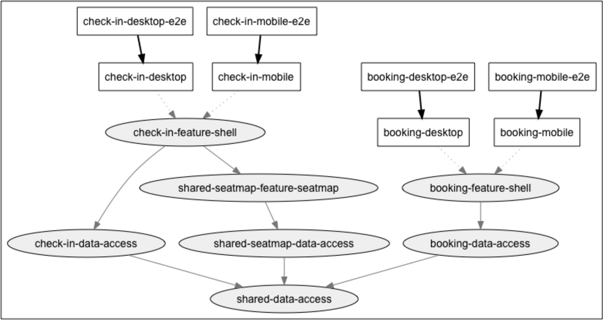
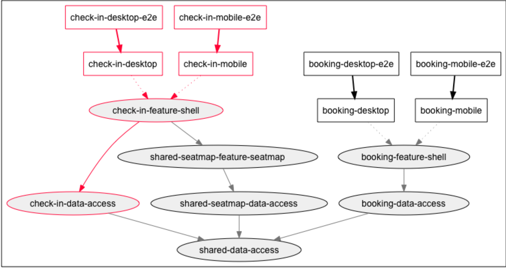
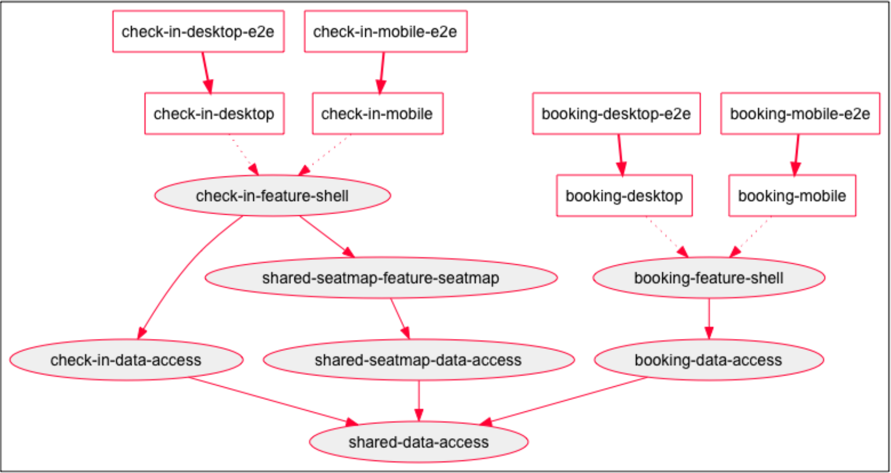

# Пересборка и повторное тестирование только затронутых приложений и библиотек

Когда мы рассматриваем большие репозитории, содержащие десятки и сотни библиотек и множество приложений, мы осознаем, что было бы очень сложно тестировать и собирать их все при добавлении нового кода. Это не масштабируется. Ручное отслеживание зависимостей тоже не подходит: это было бы ненадежно. Было бы здорово, если бы существовал надежный способ тестировать и собирать только затронутые библиотеки и приложения.

Nx использует анализ кода для определения того, что нужно пересобрать и перетестировать. Он обеспечивает это с помощью <mark style="color:red;">`affected`</mark> команд: <mark style="color:red;">`affected`</mark>, <mark style="color:red;">`affected:build`</mark>, <mark style="color:red;">`affected:test`</mark> и <mark style="color:red;">`affected:e2e`</mark>. Эти команды можно запустить со следующими опциями, чтобы определить только те библиотеки и приложения (они же "проекты"), на которые влияют ваши изменения кода.

### Опции для выбора конкретных проектов

* **Сравните изменения между двумя git-коммитами**: Вы можете выполнить <mark style="color:red;">`--base=SHA1 --head=SHA2`</mark>, где SHA1 - это тот, с которым вы хотите сравнить, а SHA2 содержит изменения. Это создаст список файлов, который мы можем использовать, чтобы определить, какие проекты затронуты этими изменениями, и обрабатывать только их.


This also includes untracked and uncommitted changes!


* **Явные файлы**: Используйте <mark style="color:red;">`--files`</mark> для предоставления явного списка файлов через запятую (полезно во время разработки).
* **Все проекты**: Используйте <mark style="color:red;">`--all`</mark> для принудительного выполнения команды для всех проектов, а не только для тех, на которые влияют изменения кода.
* **Только последний провалившийся**: Используйте <mark style="color:red;">`--only-failed`</mark>, чтобы изолировать только те проекты, которые ранее провалились (по умолчанию: false).


Следующие опции являются приватными: <mark style="color:red;">`--uncommitted`</mark> и <mark style="color:red;">`--untracked`</mark>. Их не следует использовать напрямую.


### Дополнительные опции

* <mark style="color:red;">`--parallel`</mark>: Распараллеливать команду (по умолчанию: false)
* <mark style="color:red;">`--maxParallel`</mark>: Установить максимальное количество параллельных процессов (по умолчанию: 3)
* <mark style="color:red;">`--exclude`</mark>: Исключить определенные проекты (список через запятую)

> Все остальные опции передаются базовой команде CLI.

### Обзор

Возьмем в качестве примера наш образец репозитория (nrwl-airlines). Граф зависимостей в нем выглядит следующим образом:

<figure><figcaption><p>Рисунок 12. Исходный граф зависимостей</p></figcaption></figure>

#### Сценарий 1: Изменение в библиотеке конкретного приложения

Если мы изменим файл в библиотеке <mark style="color:red;">`check-in-data-access`</mark>, то увидим, что он влияет только на <mark style="color:red;">`check-in-feature-shell`</mark>, <mark style="color:red;">`check-in-desktop`</mark> и <mark style="color:red;">`check-in-mobile`</mark>.

<figure><figcaption><p>Рисунок 13. Нам не нужно собирать или тестировать <mark style="color:red;"><code>booking</code></mark> или <mark style="color:red;"><code>seatmap</code></mark>!</p></figcaption></figure>

#### Сценарий 2: Изменение в shared библиотеке

Если теперь мы изменим файл в библиотеке <mark style="color:red;">`shared-data-access`</mark>, то увидим, что это повлияет на все проекты в рабочем пространстве! Влияние значительное, и поэтому мы знаем, что должны проявить особую осторожность и связаться с владельцами других проектов, чтобы убедиться, что все знают об изменениях.

<figure><figcaption><p>Рисунок 14. Изменения, внесенные в библиотеку <mark style="color:red;"><code>shared-data-access</code></mark>, влияют на весь проект</p></figcaption></figure>

#### Преимущества использования "Affected" команд

Разница между сценарием 1 и сценарием 2 довольно очевидна: пересборка или повторное тестирование только затронутых проектов может оказать огромное влияние время, которое занимают сборки и тесты. Нам также не нужно деплоить изменения в проектах, которые не изменились.

Другим важным преимуществом является то, что нам не нужно запускать тесты для проектов, которые не были затронуты нашими изменениями. Это также существенно влияет на время необходимое для CI.

### Параллельное выполнение команд

При выполнении этих команд Nx топологически сортирует проекты и выполняет то, что может, параллельно. Но мы также можем явно передать команду <mark style="color:red;">`--parallel`</mark> следующим образом:

```shell
npm run affected:build -- --base=master --parallel
npm run affected:test -- --base=master --parallel
npm run affected:e2e -- --base=master --parallel
```

Мы также можем передать <mark style="color:red;">`--maxParallel`</mark>, чтобы ограничить максимальное количество используемых параллельных процессов.

```shell
npm run affected:build -- --base=master --parallel --maxParallel=4
```
