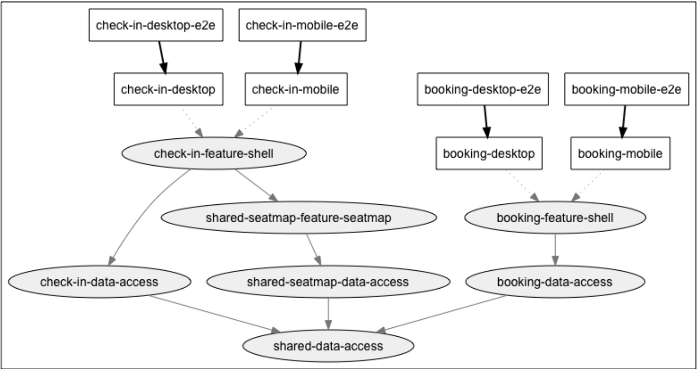

# Как работать с изменениями кода в разных командах

Рассмотрим пример репозитория. Граф зависимостей приведен ниже:

<figure><figcaption>
Рисунок 15. Пример структуры репозитория и зависимостей
</figcaption></figure>

В нашем репозитории есть четыре (4) приложения, которые необходимо развернуть: десктопная и мобильная версии <mark style="color:red;">`booking`</mark> и <mark style="color:red;">`check-in`</mark>. Все приложения имеют неявную зависимость от библиотеки <mark style="color:red;">`shared-data-access`</mark>.

Ниже перечислены некоторые из распространенных проблем, которые могут возникнуть:

1. Команда которая работает над <mark style="color:red;">`booking`</mark> вносит изменения в <mark style="color:red;">`shared-data-access`</mark>: как они могут сообщить об изменениях команде которая работает над <mark style="color:red;">`check-in`</mark>, чтобы убедиться, что ничего не сломалось?
2. Команда которая работает над <mark style="color:red;">`check-in`</mark> провалила QA и должна внести исправления в код; однако в репозитории <mark style="color:red;">`booking`</mark> появился новый код.
3. Команда которая работает над <mark style="color:red;">`seatmap`</mark> обнаружила ошибку в  продакшене: как мы можем исправить ее и убедиться, что исправление также находится в нашей кодовой базе?
4. Сборки и тесты занимают много времени в CI: как мы можем сократить это время?
5. Команды запутались в том, какие ветки им следует поддерживать: как мы можем убедиться, что главная (trunk) ветка пригодна для развертывания? Стоит ли вообще переходить на такой тип разработки?

Есть несколько способов минимизировать влияние изменений кода, вносимых другими командами:

1. Убедитесь, что **в настройках репозитория запрещено обычный merge** и вместо этого разрешен merge с rebase (или fast-forward). Это гарантирует, что разработчик получит все последние изменения (и протестирует код) из общей ветки перед merge'ем PR.
2. Убедитесь, что **PR очень малы по охвату**. Это значительно снижает риск, а также позволяет улучшить ревью (как с код-ревью, так с помощью ручного тестирования).
3. Используйте **feature переключатели**, чтобы feature, которые еще находятся в разработке, не были видны конечному пользователю (см. [раздел](kak-rabotat-s-izmeneniyami-koda-v-raznykh-komandakh.md#feature-pereklyuchateli) ниже).
4. **Будьте в курсе (и предупреждайте других) об изменениях в общем коде** и минимизируйте риск следующим образом:
   1. Создайте новую версию кода (метода/класса/библиотеки).
   2. Разрабатывайте новую версию до тех пор, пока она не будет готова.
   3. Выпустите предупреждение об устаревании (deprecation warning) старого метода/класса/библиотеки с установленным сроком действия.
   4. Работайте с другими командами, чтобы помочь им перейти на новую версию (см. [Владение кода](kak-rabotat-s-izmeneniyami-koda-v-raznykh-komandakh.md#vladenie-kodom) ниже).
   5. Удалите старую версию по истечении срока действия.

Давайте подробнее рассмотрим два решения, представленных выше, для решения проблемы управления изменениями кода между командами: владельцы кода и features (они же feature флаги).

### Владение кодом

Хорошим способом распределения ответственности за библиотеку является назначение владельцев кода для определенной библиотеки в рабочем пространстве Nx. Владелец кода (обычно это группа, а не один человек) отвечает за все изменения в библиотеке и организует процесс списания и перехода на новые версии кода.

Работа с владельцем кода для общего кода устраняет догадки и помогает сформулировать план, когда дело доходит до изменения общего кода. Когда приходит время интеграции, сюрпризов становится меньше.

Github позволяет указывать владельцев кода в репозитории, и подобная функциональность может быть доступна в git или CI-провайдере вашей организации.

### Feature переключатели

Существует два типа переключателей функций: во время сборки и во время время выполнения.

Переключатели во время сборки рекомендуются для инициализационных настроек (настройки соединения/URL, настройки макета и т.д.), которые необходимы при загрузке приложения, чтобы мы не ждали завершения сетевого запроса перед отрисовкой приложения.

Feature переключатели во время выполнения обычно осуществляется через сетевые вызовы к файлу настроек, расположенному на сервере. Они предназначены для сценариев, в которых мы хотим управлять настройками, без ребилда приложения. Обычно они управляются через URL.

Рассмотрим два примера.

#### Переключение во время сборки

Допустим, мы переводим back-end с v1 на v2. Мы добавляем функциональность для инициализации среды приложения путем чтения из переменных окружения во время развертывания в CI/CD. Однако, поскольку это происходит во время развертывания, мы не можем динамически переключать версию по своему усмотрению после загрузки приложения.

Это переключатель времени сборки - он должен быть установлен только во время сборки или развертывания приложения. Он не может быть изменен во время выполнения.

#### Переключение во время выполнения

Допустим, команда Seatmap полностью меняет UI, чтобы места отображали гораздо больше информации для пользователя: есть ли у них дополнительное пространство для ног, находятся ли они в выходном ряду и т. д. Команда Seatmap хотела бы, чтобы пользователь мог нажать кнопку в пользовательском интерфейсе, чтобы опробовать новый пользовательский интерфейс.

Это переключатель функции во время выполнения - функция может быть включена и выключена с помощью пользовательского интерфейса, изменения URL, получения значения с сервера или любого другого метода, который получает значение для использования во время выполнения. Нам не нужно развертывать новую версию приложения.

Эти feature переключатели позволяют командам продолжать разработку функций, затрагивающих общий код, не наступая друг другу на пятки. Функции могут быть введены в кодовую базу и доработаны без включения для конечного пользователя.

Они особенно полезны при использовании trunk разработки. Давайте вкратце рассмотрим, что это значит для команд.
