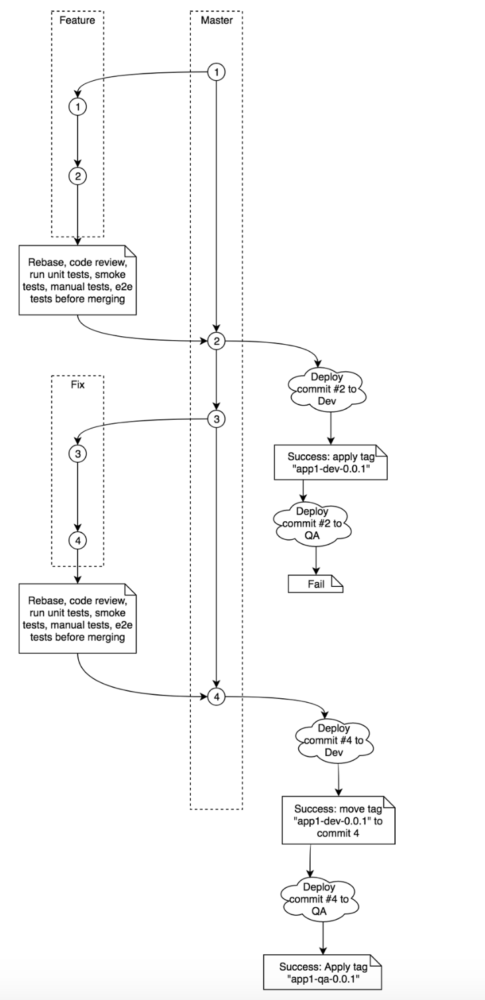

# Рекомендуемая стратегия Git

Мы рекомендуем следующее:

* Всегда используйте Pull Requests при слиянии кода. PR имеет две цели:
  * инициировать обсуждение и получить обратную связь по реализации
  * Инициировать сборку и запустить тесты и проверки, чтобы убедиться, что мы не нарушим сборку.
* Избегайте длинных ветвей и не мержите ветви локально
* Применяйте стратегию мержа git, которая обеспечивает актуальность feature ветвей перед мержем. Это гарантирует, что эти ветки будут протестированы с актуальным кодом перед мержем.

Сайт [trunkbaseddevelopment.com](https://trunkbaseddevelopment.com/) содержит много очень полезной информации о trunk-based разработке и является отличным ресурсом.

Следующие разделы являются наиболее актуальными:

* Feature флаги
* Стратегия переноса кода
* Feature ветви

<figure><figcaption>
Рисунок 17. Trunk-based разработка
</figcaption></figure>
