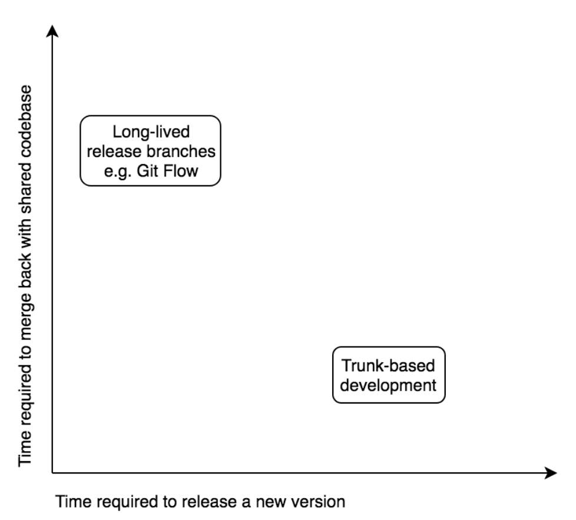

# Trunk-based разработка

Trunk-based разработка основывается на концепции наличия в репозитории одной ветви, которая выступает в качестве "ствола" или основной ветви, которую используют все команды. Это ветвь, из которой исходят все ветви фич, и та, в которую все они мержатся.

Существует две фундаментальные концепции разработки в этом подходе:

* Существование единственной ветви, из которой исходят и в которую мержатся все функциональные ветви.
* Недолговечность функциональных ветвей: каждая функциональная ветвь существует всего день или два и имеет очень конкретную цель.

Основная причина такой работы заключается в том, что долгоживущие ветви создают проблемы, когда приходит время объединить их с кодом других команд:

* Код сильно устарел, и потребуется очень много времени, чтобы разрешить все конфликты слияния.
* После разрешения конфликтов требуется дополнительный раунд регрессионного тестирования, прежде чем код может быть снова объединен.
* Очень сложно откатывать и отлаживать изменения из-за большого количества ветвей.

<figure><figcaption>
По оси Y: Время необходимое для обратного мержа общего кода По оси X: Время необходимое для релиза новой версии  Рисунок 16: В Git Flow предпочтение отдается скорости релиза новых артефактов, а не времени на мерж кода
</figcaption></figure>

Мы обычно поощряем trunk-based разработку, потому что мы верим в основные принципы:

* Ветви должны быть недолговечными и должны быть очень специфичными для выполнения определенной части работы.
* Мы считаем, что весь код должен быть как можно более актуальным для других команд, чтобы не было длительного процесса интеграции.
* Весь код, который сливается в магистральную ветку, уже протестирован на базовом уровне.

Существуют некоторые организационные трудности, связанные с реализацией этого: сроки выпуска релизов, команды, которым необходимо работать изолированно в рамках исследовательской или секретной работы, отслеживание неожиданных изменений в общем коде при попытке реализовать отдельную функцию и т.д.

Ниже приведены наши рекомендации по работе с монорепозиторием. Они должны быть адаптированы к вашей организации, но мы можем предложить некоторые рекомендации по тому, что работает в целом для большинства организаций.
