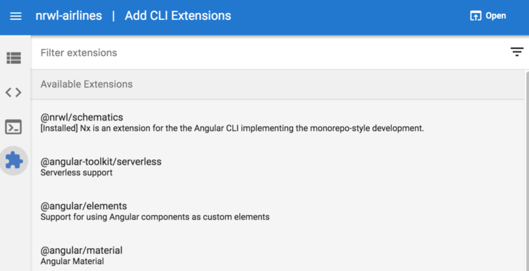

# Фичи

### Быстрые действия

Приложения, перечисленные в представленном рабочем пространстве, имеют кнопки быстрого доступа для запуска, сборки, тестирования и создания компонентов. Дополнительные действия можно найти в разделе <mark style="color:red;">`Run tasks`</mark> в левом меню.

<figure><figcaption>
Рисунок 19. Быстрые действия для приложений
</figcaption></figure>

Для библиотек есть быстрые действия для тестирования и создания компонента. Эти действия также можно найти в разделе <mark style="color:red;">`Run tasks`</mark> в левом меню.

<figure><figcaption>
Рисунок 20. Быстрые действия для библиотек
</figcaption></figure>

### Запуск npm скриптов

Angular Console считывает все команды, указанные в разделе <mark style="color:red;">`scripts`</mark> в <mark style="color:red;">`package.json`</mark>, и разрешает их выполнение.

<figure><figcaption>
Рисунок 21. Запуск скриптов из файла package.json
</figcaption></figure>

### Интерактивный граф зависимостей

Описание графа зависимостей см. в [третьей части](broken-reference) книги.

<figure><figcaption></figcaption></figure>

### Генерация кода

Мы можем генерировать схемы, обнаруженные в рабочем пространстве, выбирая их из сгруппированного списка.

<figure><figcaption>
Рисунок 22. Поддержка генерации кода
</figcaption></figure>

### Подсказки

Существует возможность выбора из списка вариантов вместо ручного ввода. Это удобно при указании пути к модулю, поскольку вам не нужно вводить путь вручную. Кроме того, переключатели являются визуальными, что позволяет вам избежать необходимости выбирать между <mark style="color:red;">`true`</mark>, <mark style="color:red;">`false`</mark>, <mark style="color:red;">`--no-option`</mark> и т.д.

### Просмотр всех доступных опций

Можно просмотреть все доступные опции командной строки. Они сгруппированы в две группы: "обязательные" и "необязательные". Также имеется вывод ожидаемого результата выполнения команды, чтобы можно было внести исправления перед выполнением команды.

<figure><figcaption>
Рисунок 23. Ожидаемый результат
</figcaption></figure>

### Сторонние расширения

Сторонние расширения можно добавлять из курируемого списка.

<figure><figcaption>
Рисунок 24. Добавление сторонних расширений
</figcaption></figure>
