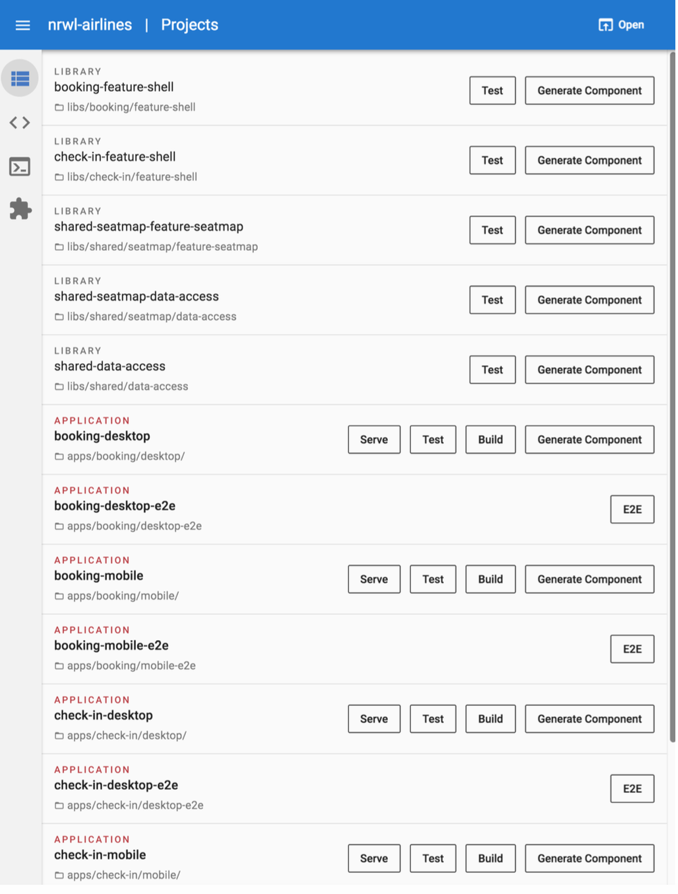

# Приложение A: Другие среды

Пользователи могут выбрать графический пользовательский интерфейс для Nx и Angular CLI. Angular Console позволяет разработчикам взаимодействовать с Nx визуально. Все опции CLI видны и интерактивны, а команды можно просматривать и выполнять прямо в интерфейсе (команды выполняются с помощью Angular CLI под капотом).

На скриншоте ниже показан пример рабочего пространства в Angular Console.

<figure><figcaption>
Рисунок 18. Angular Console
</figcaption></figure>

