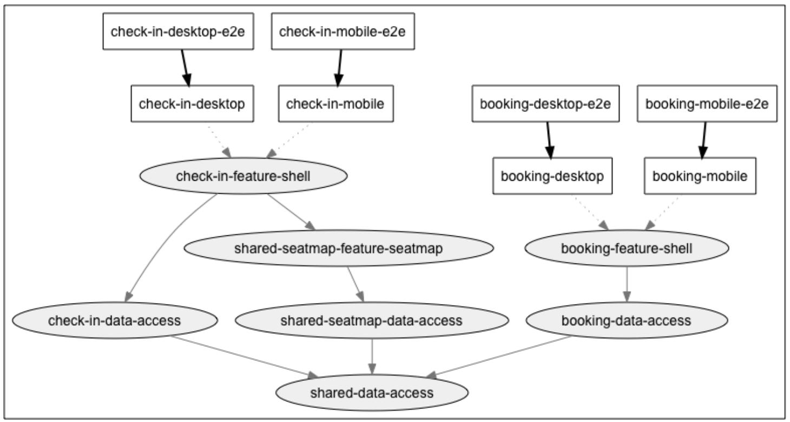

# Пример приложения

В качестве примера, который мы можем использовать на протяжении всей книги, рассмотрим вымышленную компанию Nrwl Airways. В этой организации есть три команды:

* Бронирование (Booking): Команда работает над тем, чтобы пользователь мог забронировать билет на самолет в пункт назначения.
* Регистрация (Check-in): Команда работает над тем, чтобы пользователь мог использовать онлайн-регистрацию на рейс, который он забронирован.
* Карта мест (Seatmap): Команда работает над тем, чтобы пользователь мог выбрать место на рейсе в графическом виде.

Существует четыре (4) приложения, которые развертываются (deploy) отдельно: check-in  (десктопная и мобильная версия) и booking (десктопная и мобильная версия). Конечный пользователь получает одно из этих приложений на основе URL-адреса, который он посещает (booking.nrwl-airlines.com или check-in.nrwl-airlines.com), и метаданных браузера, отправленных вместе с запросом (для отправки десктопного или мобильного приложения).

Граф зависимостей кода выглядит следующим образом:

<figure><figcaption>
Рисунок 1. Структура репозитория и зависимостей
</figcaption></figure>
